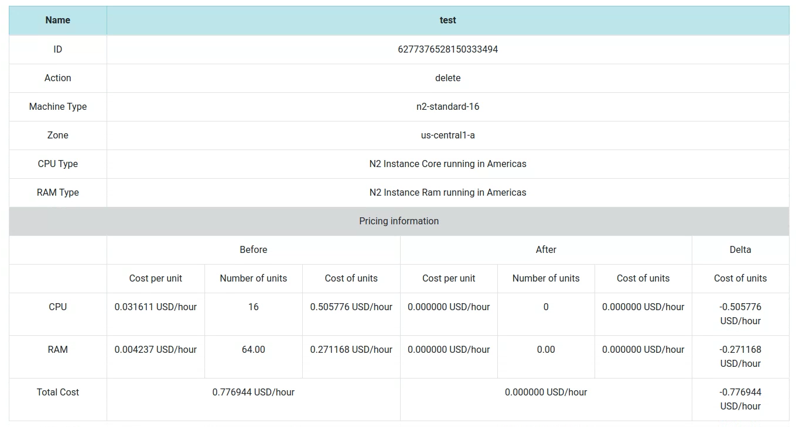

# Cost Estimation for GCP infrastructure deployed by Terraform
[](https://travis-ci.org/googleinterns/terraform-cost-estimation)

The terraform-cost-estimation project will surface a before/after cost
estimation for GCP infrastructure deployed by Terraform.

**This is not an officially supported Google product.**

Display before/after cost estimation of resources from Terraform plan files in JSON format.

Resources supported:
- **google_compute_instance**

Currently in production:
- **google_compute_disk**

## Usage
In the command line, run: 
```
$ go run main.go [OPTIONS] FILES
```
## Options
- **format**
	- Write the pricing information in the specified format.
	- Can be set to: txt, json, html.
	- If omitted, it defaults to 'txt'.

- **output**
	- Write the cost estimations to the given paths.
	- If set to 'stdout', all the outputs will be shown in the command line.
	- Multiple output file names must be delimited by ','.
	- Mixed file names and stdout values are allowed.

## Examples
### Usage on command line:
```
$ go run main.go input.json
$ go run main.go -output=json input.json
$ go run main.go -format=html -output=out1.html,out2.html input1.json input2.json
```

### Plain text output:
```
┌─────────────────────────────────────────────────────────────────────────────────────────────────────────────┐
│ The total cost change for all Resources is 0.047500 USD/hour.                                               │
├─────────────────────┬─────────────────────┬─────────────────────┬─────────────────────┬─────────────────────┤
│                                             Pricing Information                                             │
│                                                   (USD/h)                                                   │
├─────────────────────┬─────────────────────┬─────────────────────┬─────────────────────┬─────────────────────┤
│ Name                │ ID                  │ Type                │ Action              │ Delta               │
├─────────────────────┼─────────────────────┼─────────────────────┼─────────────────────┼─────────────────────┤
│ test1               │ 730331501208101640  │ n1-standard-2       │ update              │ 0.047500            │
└─────────────────────┴─────────────────────┴─────────────────────┴─────────────────────┴─────────────────────┘
 
 List of all Resources:
 
┌─────────────────────┬─────────────────────┬─────────────────────┬─────────────────────┬─────────────────────┐
│ Name                │                                         test1                                         │
├─────────────────────┼───────────────────────────────────────────────────────────────────────────────────────┤
│ ID                  │                                   730331501208101640                                  │
├─────────────────────┼───────────────────────────────────────────────────────────────────────────────────────┤
│ Zone                │                                     us-central1-b                                     │
├─────────────────────┼───────────────────────────────────────────────────────────────────────────────────────┤
│ Machine type        │                                    n1-standard-1 ->                                   │
│                     │                                    -> n1-standard-2                                   │
├─────────────────────┼───────────────────────────────────────────────────────────────────────────────────────┤
│ Action              │                                         update                                        │
├─────────────────────┴───────────────────────────────────────────────────────────────────────────────────────┤
│                                             Pricing Information                                             │
│                                                   (USD/h)                                                   │
├───────────────────────────────────────────┬─────────────────────┬─────────────────────┬─────────────────────┤
│                                           │ CPU                 │ RAM                 │ Total               │
├─────────────────────┬─────────────────────┼─────────────────────┼─────────────────────┼─────────────────────┤
│ Before              │ Cost                │ 0.031611            │ 0.004237            │ 0.047500            │
│                     │ per                 │                     │                     │                     │
│                     │ unit                │                     │                     │                     │
│                     ├─────────────────────┼─────────────────────┼─────────────────────┼                     │
│                     │ Number              │ 1                   │ 3.75                │                     │
│                     │ of                  │                     │                     │                     │
│                     │ units               │                     │                     │                     │
│                     ├─────────────────────┼─────────────────────┼─────────────────────┼                     │
│                     │ Units               │ 0.031611            │ 0.015889            │                     │
│                     │ cost                │                     │                     │                     │
├─────────────────────┼─────────────────────┼─────────────────────┼─────────────────────┼─────────────────────┤
│ After               │ Cost                │ 0.031611            │ 0.004237            │ 0.095000            │
│                     │ per                 │                     │                     │                     │
│                     │ unit                │                     │                     │                     │
│                     ├─────────────────────┼─────────────────────┼─────────────────────┼                     │
│                     │ Number              │ 2                   │ 7.50                │                     │
│                     │ of                  │                     │                     │                     │
│                     │ units               │                     │                     │                     │
│                     ├─────────────────────┼─────────────────────┼─────────────────────┼                     │
│                     │ Units               │ 0.063222            │ 0.031778            │                     │
│                     │ cost                │                     │                     │                     │
├─────────────────────┼─────────────────────┼─────────────────────┼─────────────────────┼─────────────────────┤
│ DELTA               │ UP (↑)              │ 0.031611            │ 0.01588875          │ 0.04749975          │
└─────────────────────┴─────────────────────┴─────────────────────┴─────────────────────┴─────────────────────┘
```
### Html output:


